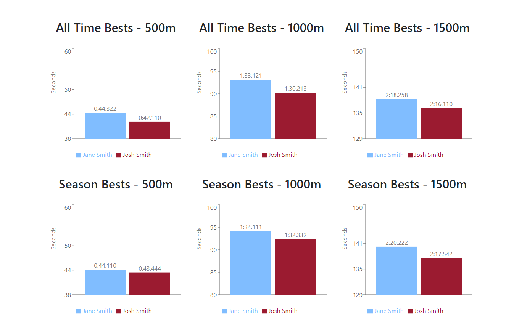

# Shorttrack Results

Shorttrack Results is a user-friendly web application for speed skating enthusiasts, allowing users to explore and analyze short track speed skating data. It offers personalized skater search, side-by-side comparisons, and tracks all-time and season bests. Includes an admin feature that enables users to add, edit, and update skater information.



## Description

A comprehensive web application designed for speed skating enthusiasts and athletes worldwide. Built on the PERN stack (PostgreSQL, Express.js, React, Node.js), it provides a modern and intuitive platform for exploring and analyzing short track speed skating data. Users can easily navigate through the application to search for skaters based on various filters such as country, age group, and gender, offering a tailored browsing experience. A feature of Shorttrack Results is its ability to compare skaters side-by-side, allowing users to gain unique insights into performance and achievements. It also tracks each skater's all-time and seasonal best data, providing historical context and enabling users to witness their progress and accomplishments over time. With an admin feature, authorized users can seamlessly add, edit, and update skater information, ensuring that the platform stays up-to-date with the latest details. Shorttrack Results leverages Docker to simplify deployment and enables easy data persistence and management. Overall, it serves as a showcase project while providing a resource for shorttrack enthusiasts to explore and analyze short track speed skating data.

## Getting Started

### Dependencies

- Docker Engine 1.13.0+ (to run compose file v3)

### Installing

```
git clone https://github.com/helioshe4/Shorttrack-Results.git
cd Shorttrack-Results/
```

### Executing program

```
docker-compose up -d --build
```
or 
```
./tools/build.sh
```

<!-- ## Help -->


## Authors

Helios He  
helios.he@uwaterloo.ca

## Version History

- June 2023
  - Initial Release

<!-- ## License

This project is licensed under the [NAME HERE] License - see the LICENSE.md file for details

## Acknowledgments

Inspiration, code snippets, etc.

- [awesome-readme](https://github.com/matiassingers/awesome-readme)
- [PurpleBooth](https://gist.github.com/PurpleBooth/109311bb0361f32d87a2)
- [dbader](https://github.com/dbader/readme-template)
- [zenorocha](https://gist.github.com/zenorocha/4526327)
- [fvcproductions](https://gist.github.com/fvcproductions/1bfc2d4aecb01a834b46) -->
