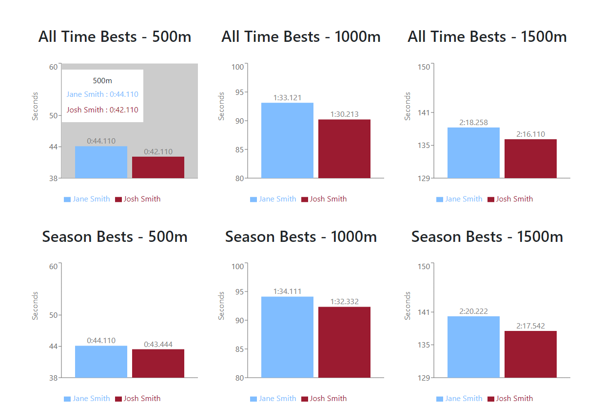

# Shorttrack Results

Shorttrack Results is a user-friendly web application for speed skating enthusiasts, allowing users to explore and analyze short track speed skating data. It offers personalized skater search, side-by-side comparisons, and tracks all-time and season bests. Includes an admin feature that enables users to add, edit, and update skater information.



## Description

Shorttrack Results is a comprehensive web application for speed skating enthusiasts and athletes worldwide, built on the PERN stack. It offers a modern platform for exploring short track speed skating data, allowing users to search for skaters based on various filters. The application features side-by-side skater comparisons, tracks all-time and seasonal best data, and includes an admin feature for managing skater information. Leveraging Docker for easy deployment and data management, Shorttrack Results serves as a showcase project while providing a valuable resource for short track enthusiasts.

## Getting Started

### Dependencies

- Docker Engine 1.13.0+ (to run compose file v3)

### Installing

```
git clone https://github.com/helioshe4/Shorttrack-Results.git
cd Shorttrack-Results/
```

### Executing program

```
docker-compose up -d --build
```
or 
```
./tools/build.sh
```

<!-- ## Help -->


## Authors

Helios He  
helios.he@uwaterloo.ca

## Version History

- June 2023
  - Initial Release

<!-- ## License

This project is licensed under the [NAME HERE] License - see the LICENSE.md file for details

## Acknowledgments

Inspiration, code snippets, etc.

- [awesome-readme](https://github.com/matiassingers/awesome-readme)
- [PurpleBooth](https://gist.github.com/PurpleBooth/109311bb0361f32d87a2)
- [dbader](https://github.com/dbader/readme-template)
- [zenorocha](https://gist.github.com/zenorocha/4526327)
- [fvcproductions](https://gist.github.com/fvcproductions/1bfc2d4aecb01a834b46) -->
